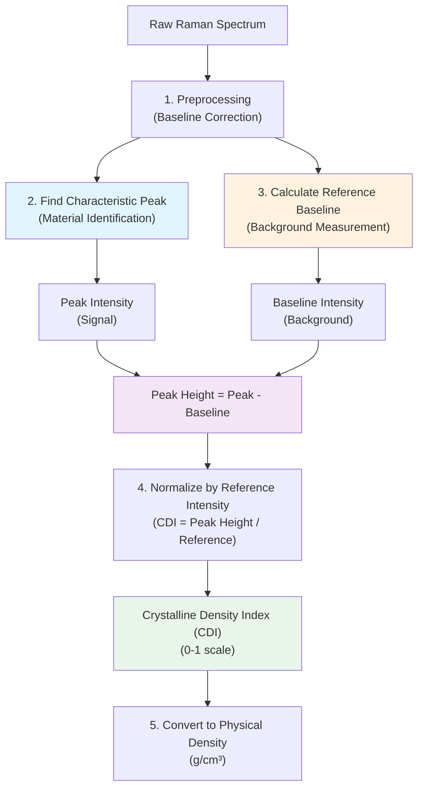

# RamanLab Density Analysis System Summary

## Overview

The RamanLab density analysis system calculates material densities from Raman spectroscopic data using the **Crystalline Density Index (CDI)** methodology. This approach is particularly effective for analyzing **crystalline/amorphous relationships** in materials, providing quantitative density estimates from spectral peak intensity ratios.

## Theory and Applications

### Best Use Cases
The CDI methodology works optimally for:

- **Crystalline vs. Amorphous Materials**: Distinguishing between ordered and disordered phases
- **Mixed-Phase Systems**: Quantifying the ratio of crystalline to amorphous content
- **Biomedical Applications**: Kidney stones, bone mineralization, dental enamel
- **Geological Materials**: Silicate minerals, carbonates, clay minerals
- **Materials Science**: Glass-ceramic transitions, polymer crystallinity
- **Quality Control**: Pharmaceutical crystallinity, food crystal content

### Theoretical Basis
The method relies on the principle that **crystalline materials produce sharper, more intense Raman peaks** compared to amorphous phases. The CDI quantifies this difference by:

1. Measuring characteristic peak intensities
2. Normalizing against background/baseline levels
3. Scaling to reference standards
4. Converting to physical density estimates

## CDI Calculation Process

### Workflow Diagram



### Step-by-Step Process

#### 1. **Spectrum Preprocessing**
```python
def preprocess_spectrum(self, wavenumber, intensity):
    # Remove cosmic rays and smooth data
    # Apply ALS baseline correction
    # Normalize intensity range
```

#### 2. **Characteristic Peak Identification**
The system identifies material-specific peaks:
- **Kidney Stones (COM)**: 1462 cm⁻¹ (main), 895 cm⁻¹, 1630 cm⁻¹
- **Quartz**: 464 cm⁻¹ (main), 206 cm⁻¹, 354 cm⁻¹  
- **Calcite**: 1086 cm⁻¹ (main), 282 cm⁻¹, 712 cm⁻¹
- **Custom Materials**: User-defined characteristic peaks

#### 3. **Reference Region Analysis**
Reference regions provide baseline measurements:
- **Baseline Region**: Low-intensity spectral areas for background correction
- **Fingerprint Region**: Material-specific vibrational ranges
- **High-Frequency Region**: Additional normalization references

#### 4. **CDI Calculation**
```python
def calculate_crystalline_density_index(self, wavenumber, intensity):
    # Find main characteristic peak intensity
    main_peak = self.characteristic_peaks['main']
    peak_idx = np.argmin(np.abs(wavenumber - main_peak))
    peak_intensity = intensity[peak_idx]
    
    # Calculate baseline from reference region
    baseline_region = self.reference_regions['baseline']
    baseline_mask = (wavenumber >= baseline_region[0]) & (wavenumber <= baseline_region[1])
    baseline_intensity = np.nanmean(intensity[baseline_mask])
    
    # Calculate corrected peak height
    peak_height = peak_intensity - baseline_intensity
    
    # Normalize to get CDI (0-1 scale)
    cdi = min(peak_height / self.reference_intensity, 1.0)
    
    return cdi, metrics
```

#### 5. **Density Conversion**
The CDI is converted to physical density using material-specific calibration:
```python
def calculate_apparent_density(self, cdi):
    # Linear mixing model between phases
    apparent_density = (self.densities['matrix'] + 
                       (self.densities['crystalline'] - self.densities['matrix']) * cdi)
    return apparent_density
```

## Key Components

### Characteristic Peaks vs Reference Regions

| Component | Purpose | Function | Example |
|-----------|---------|----------|---------|
| **Characteristic Peaks** | Material identification | Define which peaks to measure | COM: 1462 cm⁻¹ |
| **Reference Regions** | Background normalization | Establish baseline levels | COM: (400-600 cm⁻¹) |

### Material Configurations

Each material type has optimized parameters:

#### Kidney Stones (COM)
- **Peaks**: 1462, 895, 1630 cm⁻¹
- **Regions**: C-H stretch (2800-3000), Amide I (1640-1680), baseline (400-600)
- **Density Range**: 1.0-2.23 g/cm³ (organic matrix to pure COM crystal)

#### Quartz  
- **Peaks**: 464, 206, 354 cm⁻¹
- **Regions**: Low-freq (100-300), fingerprint (300-600), baseline (700-900)
- **Density Range**: 1.5-2.65 g/cm³ (amorphous silica to pure quartz)

#### Calcite
- **Peaks**: 1086, 282, 712 cm⁻¹  
- **Regions**: Carbonate (1000-1200), lattice (200-400), baseline (600-800)
- **Density Range**: 1.9-2.71 g/cm³ (organic-rich to pure calcite)

## Integration with Batch Peak Fitting

### Automated Workflow
The system integrates with RamanLab's batch peak fitting for streamlined analysis:

1. **Batch Peak Fitting**: Process multiple spectra to identify peaks
2. **Peak Analysis**: Extract characteristic peaks and intensities
3. **Reference Calculation**: Determine optimal reference intensity from actual data
4. **Custom Material Creation**: Generate material-specific configurations
5. **Density Analysis**: Apply CDI methodology with validated parameters

### Smart Parameter Extraction
```python
def _analyze_batch_for_material_config(self):
    # Group peaks by position (±10 cm⁻¹ tolerance)
    # Identify most common/intense peaks as characteristic peaks
    # Calculate median intensities for reference values
    # Determine spectral range for reference regions
    # Generate material-specific configuration
```

## Output and Interpretation

### CDI Scale (0-1)
- **0.0-0.2**: Highly amorphous/organic material
- **0.2-0.5**: Mixed amorphous-crystalline phases  
- **0.5-0.8**: Predominantly crystalline with some amorphous content
- **0.8-1.0**: Highly crystalline material

### Physical Density Output
- **Apparent Density**: Linear mixing model between end-member densities
- **Specialized Density**: Material-specific calibrations (e.g., biofilm types)
- **Classification**: Categorical assessment based on thresholds

### Quality Metrics
The system provides validation metrics:
- **Peak Width**: FWHM analysis for peak quality assessment
- **Spectral Contrast**: Signal-to-noise evaluation
- **Baseline Stability**: Reference region consistency
- **Material Confidence**: Agreement with known standards

## Advantages and Limitations

### Advantages
- **Quantitative**: Provides numerical density estimates
- **Standardized**: Reproducible across different instruments
- **Flexible**: Adaptable to various material types
- **Automated**: Minimal user intervention required
- **Validated**: Based on established crystallographic principles

### Limitations
- **Material-Specific**: Requires appropriate reference standards
- **Phase Composition**: Assumes binary crystalline/amorphous mixing
- **Peak Quality**: Dependent on sufficient signal-to-noise ratio
- **Calibration**: Needs validated reference intensities for new materials
- **Matrix Effects**: Complex compositions may require advanced modeling

## Best Practices

### Sample Preparation
- Ensure consistent measurement conditions
- Use appropriate laser power and acquisition time
- Minimize fluorescence and thermal effects
- Maintain clean sample surfaces

### Data Acquisition
- Acquire sufficient spectral range to include characteristic peaks
- Use consistent instrument settings across sample sets
- Include reference standards when possible
- Document measurement parameters

### Analysis Setup
- Select appropriate material configuration
- Validate characteristic peaks for your specific samples
- Use batch integration for optimal reference intensity determination
- Review quality metrics before interpreting results

## Future Developments

### Planned Enhancements
- **Multi-Phase Analysis**: Extension to complex phase mixtures
- **Machine Learning**: AI-assisted peak identification and classification
- **Advanced Calibration**: Non-linear density models for complex systems
- **Real-Time Analysis**: Live density monitoring capabilities
- **Database Integration**: Expanded material library with validated parameters

---

*This summary provides a comprehensive overview of the RamanLab density analysis system. For specific implementation details, refer to the source code in the `Density/` directory and the integrated batch peak fitting tools.* 